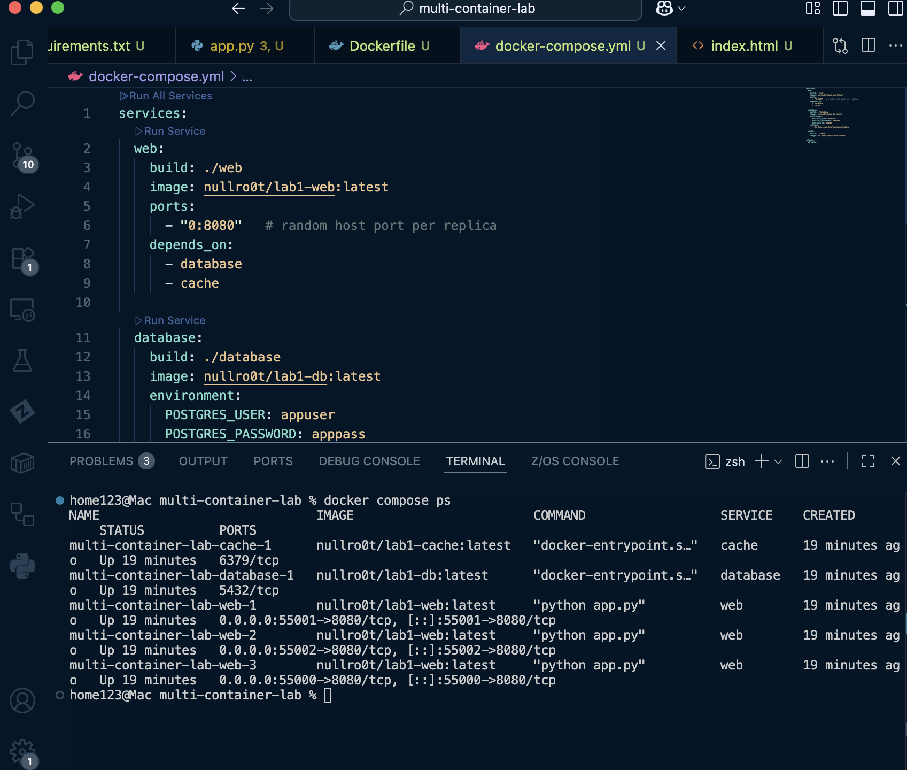
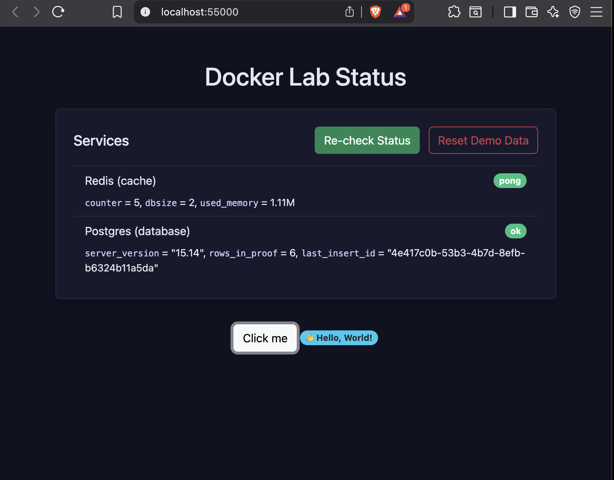
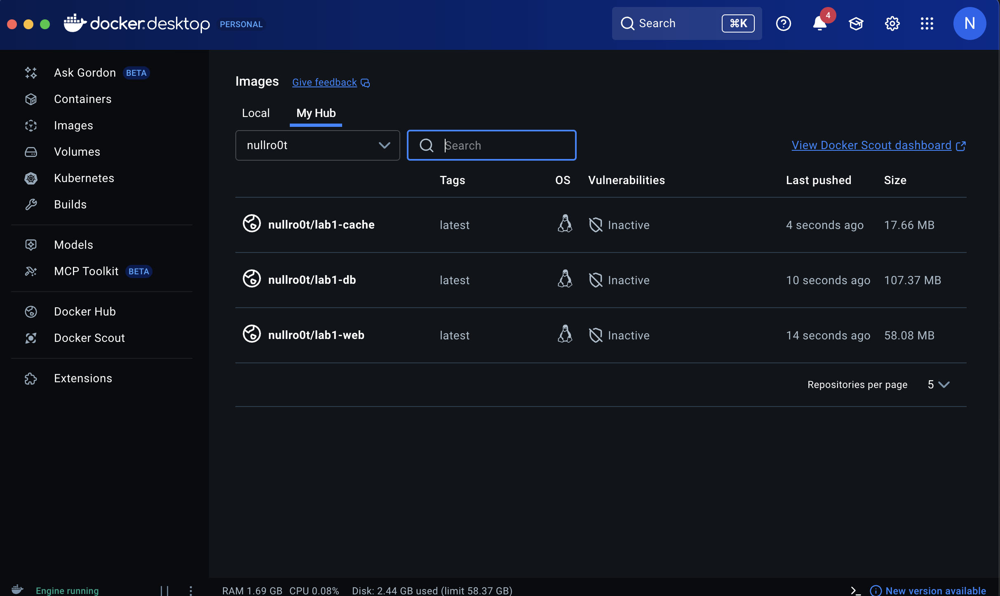
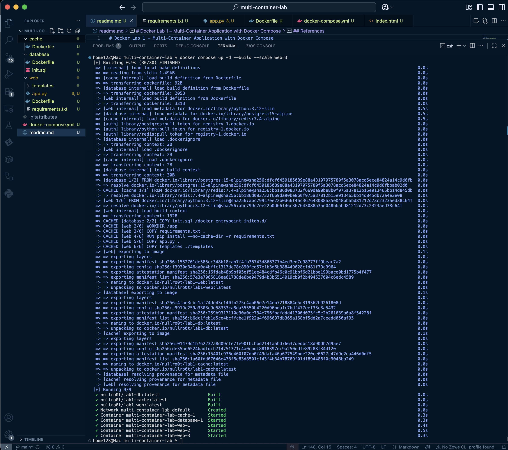

# Docker Lab 1 – Multi-Container Application with Docker Compose

This repository demonstrates containerization fundamentals by building and orchestrating a simple **multi-container application** consisting of a **Flask web app**, **Postgres database**, and **Redis cache**.
The lab covers image creation, container lifecycle management, Docker Hub integration, and service scaling using Docker Compose.

---

## Objectives

* Explore container basics and run test images (`hello-world`, Ubuntu).
* Build custom images for:

  * **Web app** → Python Flask
  * **Database** → Postgres with init script
  * **Cache** → Redis
* Orchestrate services with **docker-compose.yml**.
* Push built images to Docker Hub.
* Scale the web service horizontally using `docker compose up --scale`.

---

## Project Setup

### 1. Build and run services

```bash
docker compose up --build
```

### 2. Access the web app

Open a browser and go to:

```
http://localhost:<mapped-port>
```

* If one replica: mapped to `http://localhost:8888`
* If scaled: each replica is mapped to a random host port (e.g., `55000`, `55001`, `55002`)

### 3. Scale the web tier

```bash
docker compose up -d --scale web=3
```

Check running containers:

```bash
docker compose ps
```

### 4. Stop the environment

```bash
docker compose down
```

---

## Screenshots

* **Container status (`docker compose ps`)**
  

* **Web app running locally**
  

* **Docker Hub repositories**
  

* **Scaling to multiple web replicas**
  

---

## References

* [Docker Documentation](https://docs.docker.com/)
* [Docker Compose Docs](https://docs.docker.com/compose/)
* [Docker Hub](https://hub.docker.com/)
